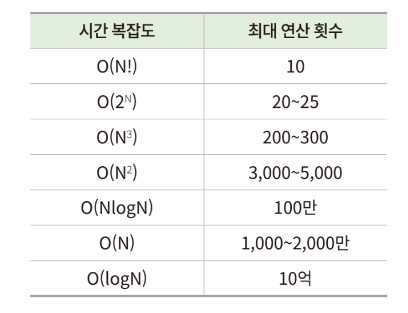

### 시간복잡도
- 알고리즘의 성능을 나타내는 지표로, 입력 크기에 따른 연산 횟수를 의미한다
- 입력 크기는 알고리즘이 처리해야 할 데이터의 양이다
- 시간복잡도는 낮을 수록 좋다

### 시간복잡도를 측정하는 방법
- 연산 횟수와 관련이 있다
- 시간복잡도는 알고리즘이 시작한 순간부터 결과값이 나올 때까지의 연산 횟수를 나타낸다
- 최선, 보통, 최악의 경우로 나뉜다

### 1차원 배열 검색으로 연산횟수 비교
- 연산 횟수가 가장 적은 경우는 배열의 첫번째 위치이다
- 연산 횟수가 가장 많은 경우는 배열의 마지막 위치이거나 찾는 값이 없는 경우이다

### 알고리즘 수행 시간을 측정하는 방법
- 절대 시간을 측정하는 방법(말 그대로 시간을 측정 but 프로그램 실행 환경에 따라 달라질 수 있어서 활용 x)
- 시간 복잡도를 측정하는 방법(연산 횟수와 관련)

### 10칸짜리 배열에서 시간 복잡도 측정
- 최선의 연산 횟수: 1
- 최악의 연산 횟수: 10
- 그러나 이러한 1과 8은 특정한 입력 크기에 따른 연산 횟수로 시간 복잡도를 이야기 하는거는 특정 상황에 한한 것으로 무의미하다
- 예를 들어 배열의 크기가 1이라면 최선, 보통, 최악의 경우는 모두 1이다

### 코딩테스트에서 알고리즘 성능 측정 2가지 
- 최악의 경우를 고려하자
- 알고리즘 성능은 정확한 연산 횟수가 아닌 추이를 활용하자  
  우리가 알고 싶은 것은 정확한 연산 횟수가 아니라 내 알고리즘이 제한 시간 안에 수행될 수 있는 지 정도만 파악하면 된다(왜? 우리가 구하려는 것은 상한의 정확한 값이 아닌 이정도 될것이다를 파악하는 추이이기 때문)
- 이러한 방식으로 충분히 큰 입력값 N에 따른 연산 횟수의 추이를 활용해서 시간 복잡도를 표현하는 방법을 점근적 표기법이라고 한다

### 최악의 경우 시간 복잡도를 표기하는 빅오표기법
- 가장 많이 사용하는 점근적 표기법은 상한선을 활용하는 방법인데 이 표기법을 빅오 표기법이라고 한다
- 빅오표기법은 최고차항만 남기고 최고차항에서도 계수를 지우면 된다

### 시간 복잡도를 코딩 테스트에 활용하는 방법
- 코딩 테스트의 문제는 1000~3000만 정도 고려해서 시간 복잡도를 생각하자
- 예를 들어 제한 시간이 1초인 문제는 연산 횟수가 3,000만이 넘는 알고리즘은 사용하면 안된다

